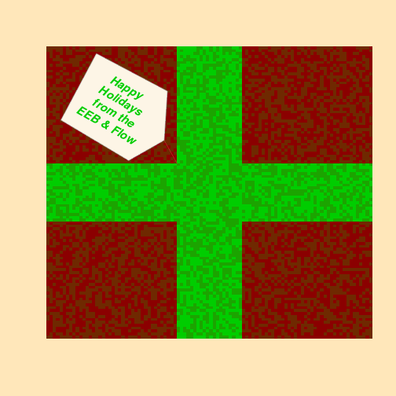

Two species in a Beverton-Holt competition model on a 2-d landscape
##################

Code from Caroline Tucker at [Eeb & Flow](http://evol-eco.blogspot.ca/2013/12/holiday-card-2013.html). Too good not to save my own copy for posterity!


```r
### Parameters
years = 15
scape = 100

# species GR
Sp1 = 50
Sp2 = 40

# landscape
sp1_land <- array(runif(scape * scape, 70, 90), c(scape, scape, (years + 1)))
sp2_land <- array(runif(scape * scape, 70, 90), c(scape, scape, (years + 1)))

y1 <- matrix(c(rep(c(rep(0.4, 40), rep(0.7, 20), c(rep(0.4, 40))), 40), rep(0.7, 
    20 * scape), rep(c(rep(0.4, 40), rep(0.7, 20), c(rep(0.4, 40))), 40)), ncol = scape, 
    nrow = scape)
y2 <- 1 - y1

res <- matrix((sp2_land[, , 1] - sp1_land[, , 1]), scape, scape)

### Functions
colrs <- colorRampPalette(sample(c("darkred", "green3"), 2, replace = FALSE))

bevertonholt2sp <- function(years, scape, sp1_land, sp2_land, res) {
    for (i in 1:years) {
        for (j in 1:scape) {
            for (k in 1:scape) {
                N1 <- sp1_land[j, k, i]
                N2 <- sp2_land[j, k, i]
                
                # growth rates
                dN1 <- N1 * rnorm(1, Sp1, 0.015)/(1 + (y1[j, k] * N2 + N1))
                dN2 <- N2 * rnorm(1, Sp2, 0.015)/(1 + (y2[j, k] * N1 + N2))
                
                # update pop sizes
                sp1_land[j, k, i + 1] <- N1 + dN1
                sp2_land[j, k, i + 1] <- N2 + dN2
                
                # pop size differences
                res[j, k] <- (sp2_land[j, k, i + 1] - sp1_land[j, k, i + 1])
            }
        }
        
        image(res, col = colrs(6), xaxt = "n", yaxt = "n", add = TRUE)
        
    }
}

par(bg = "wheat1", bty = "n", pty = "m", ps = 15)
image(res, col = colrs(6), xaxt = "n", yaxt = "n", lty = "blank")
bevertonholt2sp(years, scape, sp1_land, sp2_land, res)

polygon(x = c(0.04, 0.15, 0.37, 0.36, 0.25, 0.04), y = c(0.75, 0.98, 0.85, 0.68, 
    0.61, 0.75), col = "oldlace", border = "darkgrey")
lines(x = c(0.36, 0.4), y = c(0.68, 0.6), lwd = 0.75, col = "brown3")
text(x = 0.21, y = 0.8, "Happy\n Holidays\n from the\n EEB & Flow", cex = 1, 
    col = colrs(6)[6], font = 4, srt = -30)
```

 


